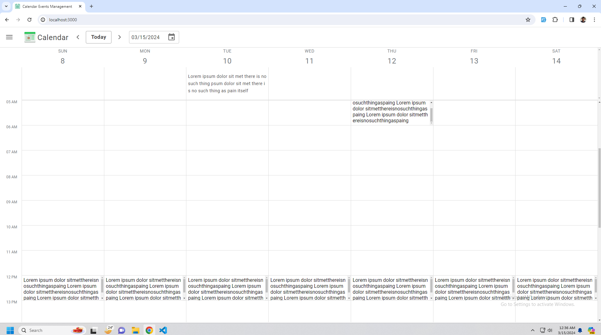

# Calendar Events Management 

### Clone this repository at first and run below commands.
```sh
npm install
```

```sh
npm start
```

### These commands will 
- Install **concurrently** package in root directory
- Install related dependencies inside the [**packages/backend**](/packages/backend/) and [**packages/frontend**](/packages/frontend/) directory. 
- And then will **run** both **backend** and **frontend**. 

### After running the project, URL:
Backend: http://localhost:5000/
<br />
Frontend: http://localhost:3000/

### Note
- **Backend: Implementation is done**
- **Frontend: Just completed the design. Functionalities will be added later.** 



### Tools
- **husky** added 
- husky will run linter in **Frontend** part while **pre-commit**, and check the linter  
- Also husky will build the **Frontend** while **pre-push** and won't push in case of build failure. 
